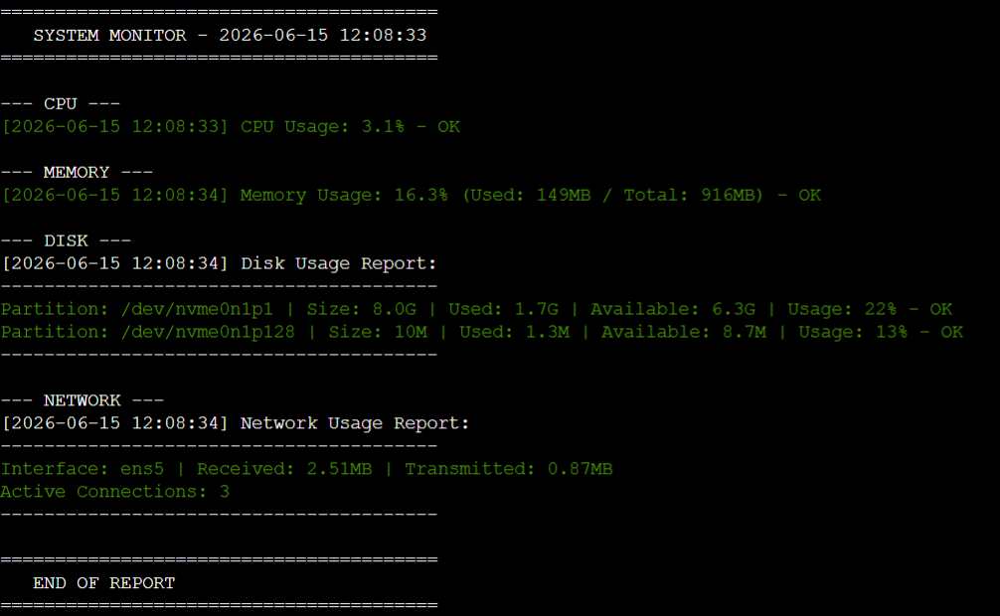
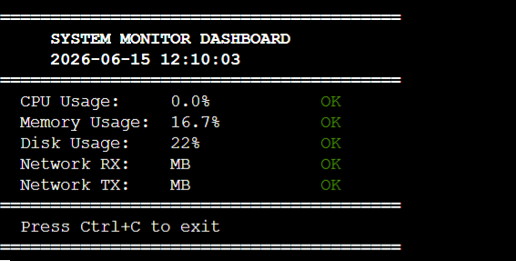
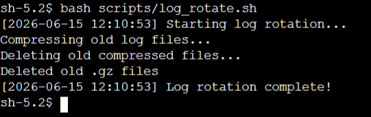
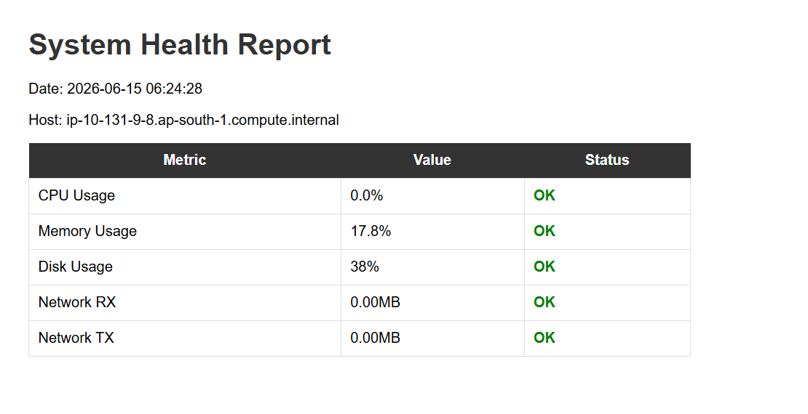
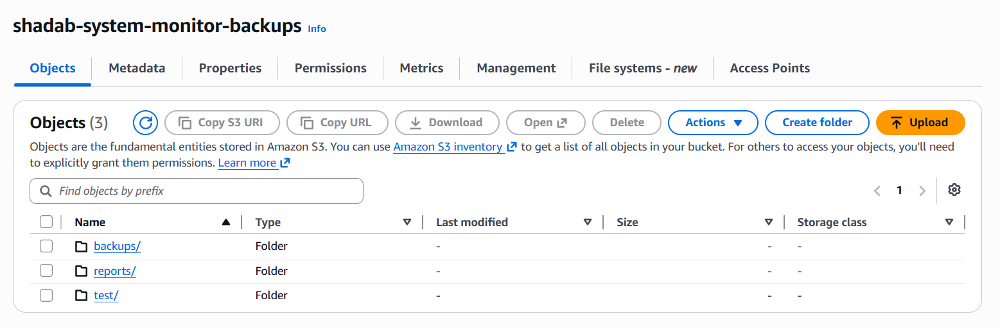

# System Monitoring & Automation Suite

## Why I Built This

I built this project because I wanted to understand how Linux monitoring 
actually works. In DevOps there are many monitoring tools like Prometheus, 
Grafana, and Datadog but I wanted to first understand the basics. 
This project gave me the big picture of where simple Bash scripting has 
limits and why those tools were built in the first place.

## My Journey

Starting this project was the hardest part. I had no local Linux setup 
and didn't know how to connect AWS with this idea. I faced SSH connection 
failures due to port 22 being blocked on my mobile hotspot, launched EC2 
in the wrong region Stockholm instead of Mumbai, and had to learn 
SSM Session Manager from scratch just to connect to my own server.

Three things genuinely surprised me during this build:

1. rsync only copies changed files not everything. This saved significant 
time and storage on backups.

2. SSM Session Manager connected to EC2 without any PEM key or open ports
just IAM role. Much cleaner than SSH.

3. CloudShell files can be lost. This pushed me to integrate S3 properly 
instead of treating it as optional.

## What This Project Does

- Monitors CPU, Memory, Disk and Network every 5 minutes via cron
- Color coded alerts green/yellow/red based on configurable thresholds
- Automated log rotation with gzip compression
- Full backup every Sunday, incremental backup Monday to Saturday
- All backups uploaded to AWS S3 automatically
- Generates HTML, CSV and Text reports
- Interactive terminal dashboard with auto refresh
- Deployed on AWS EC2 via SSM Session Manager

## Screenshots

### System Monitor Output

### Terminal Dashboard

### Log Rotation

### HTML Report

### S3 Backup Bucket

## Tech Stack

Bash | Linux | Cron | rsync | Git | AWS EC2 | AWS S3 | SSM Session Manager

## Project Structure

scripts/
    monitor.sh
    cpu_monitor.sh
    memory_monitor.sh
    disk_monitor.sh
    network_monitor.sh
    dashboard.sh
    log_rotate.sh
    backup_full.sh
    backup_incremental.sh
    backup_s3.sh
    report_text.sh
    report_csv.sh
    report_html.sh
config/
    config.cfg
logs/
reports/
backups/
screenshots/

## Setup

git clone https://github.com/mdshadab41/system-monitor.git
cd system-monitor
chmod +x scripts/*.sh
nano config/config.cfg
bash scripts/monitor.sh

## Cron Schedule

*/5 * * * *  monitor.sh            Every 5 minutes
0 * * * *    report_html.sh        Every hour
0 0 * * *    log_rotate.sh         Daily midnight
0 2 * * 0    backup_full.sh        Sunday 2am
0 2 * * 1-6  backup_incremental.sh Mon-Sat 2am
0 3 * * *    backup_s3.sh          Daily 3am

## Author

Shadab Rayeen
GitHub: https://github.com/mdshadab41
LinkedIn: www.linkedin.com/in/md-shadab-a52981130
